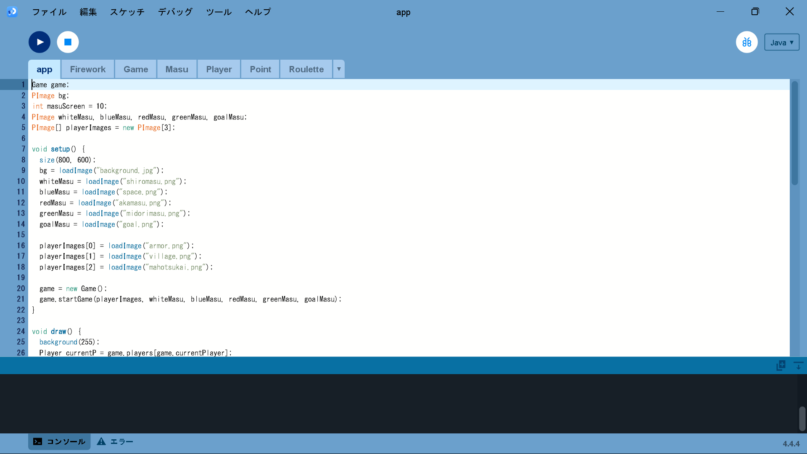
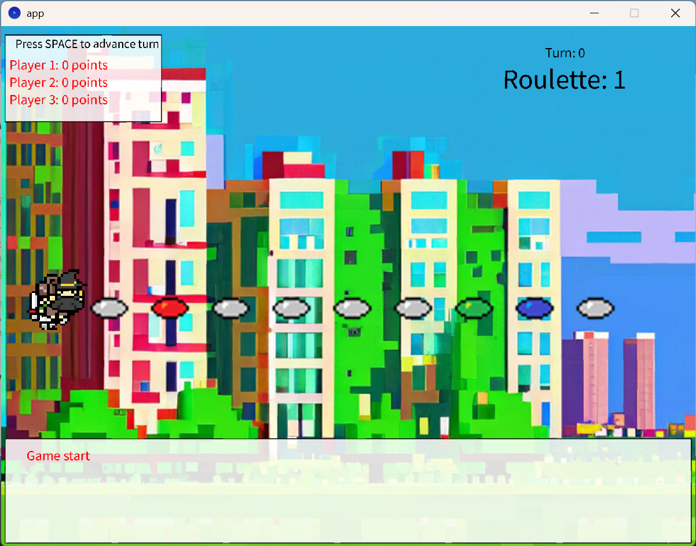
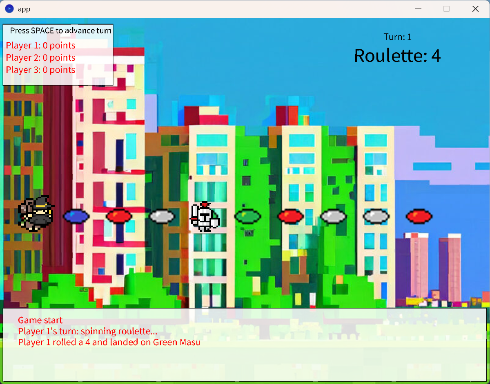
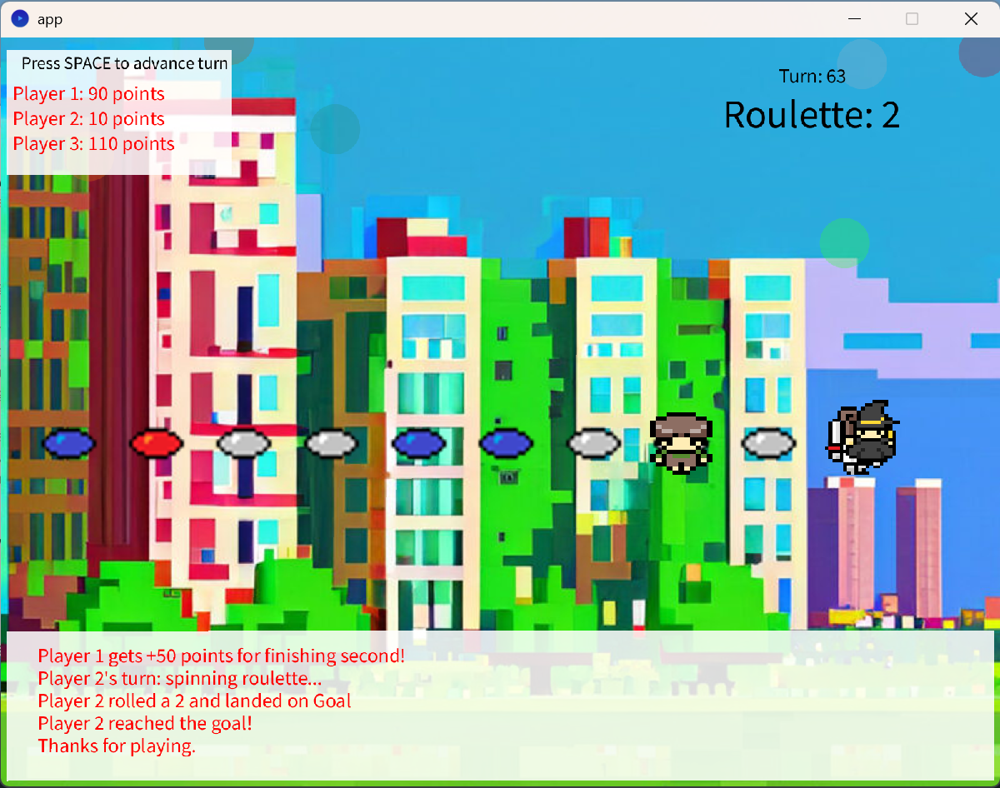

# 取り扱い説明書

## 📌 すごろくゲーム

### 🌍 テーマ（世界観）
- 現代風ファンタジー

---

## 🎮 ゲーム仕様

### 🔢 基本ルール
- **マス数**：60マス
- **プレイ人数**：3人
- **想定プレイ時間**：20～30分
- **勝利条件**：ポイント制
- **ルーレット**：6マス（1～6）
- **順番**：Player 1 → Player 2 → Player 3 の順に進行

### 🎲 イベントマス（種類と内容）
- **白マス**：イベントなし
- **青マス**：+10ポイント or +20ポイント or 2マス進む
- **赤マス**：-10ポイント or -20ポイント or 2マス戻る
- **緑マス**：1ターン休み

---

## 操作方法
1．Processing で app.pde を開いた状態で「▶」を押す． 
  

「▶」を押すと，次のような画面が表示される． 
※マスの色はランダムに表示されます．以下の画面と同じように表示されるとは限りません． 
  

2．Player 1 がスペースキーを押してルーレットを回す．  

スペースキーを押すと，次のようになる． 
※ルーレットの数はランダムです．以下の画面と同じように表示されるとは限りません． 
  

3．Player 1 → Player 2 → Player 3 の順にゲームを進める．  

4．全員がゴールするまでルーレットを回し続ける．  

5．「Thanks for playing.」と表示されたらゲーム終了． 

